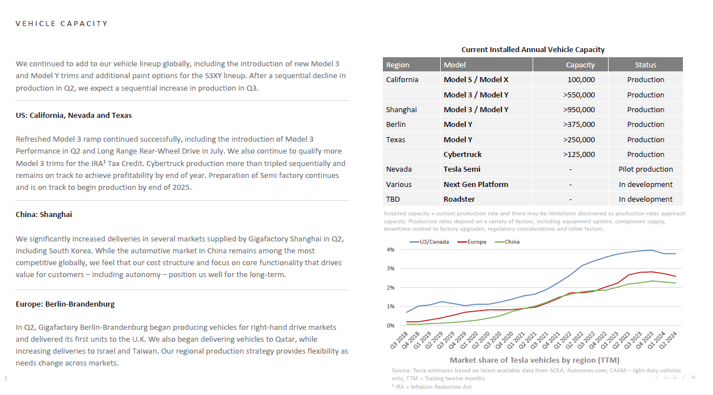

# PDF Safe Cracker
PDF Safecracker is an application that allows you to extract information such as tables, titles, and paragraphs from even very complex formats in a precise and reliable manner.

## Prerequisites

Before running the script, ensure that you have the following installed on your system in order to download LayoutDetection Model. 

- **Git**: Version control system.
- **Git LFS**: Git extension for versioning large files.

You can install Git and Git LFS using the following commands:

```bash
# Install Git
sudo apt-get update
sudo apt-get install git

# Install Git LFS
sudo apt-get install git-lfs
git lfs install
```

## Downloading the Model

To download the Layout Model open a terminal in the main folder and run 

```bash
chmod +x download_model.sh
./download_model.sh
```

If you have now a folder called 'models' with the model inside you are good to go.

## Get started 

You can find and example on how to use the class directly on a pdf in the file 'main.py'

```python
import os
from utils import load_pdf, convert_latex, latex_rm_whitespace
from core.layout import PdfExtraction


if __name__ == "__main__":
    extractor = PdfExtraction()
    images = load_pdf("TSLA-Q2-2024-Update.pdf")
    results = extractor.run(images[7])
    for r in results:
        if r['category_id'] == 5: ## 5 is Tables
            table = latex_rm_whitespace(r['text'][0])
            converted_table = convert_latex(tables=[table])
            print("Table:\n")
            print(converted_table['markdown'])
        else:
            if "text" in r:
                if r['category_id'] == 0: ## this is a title
                    print(f"## {r['text']}\n")
                elif r['category_id'] == 6: #table caption
                    print(f"Table: {r['text']}")
                else:
                    print(f"{r['text']}\n")
```

## Example



```
VEHICLE CAPACITY 

Table: Current Installed Annual Vehicle Capacit 
Table:

  [**Region**]{style="color: white"}   [**Model**]{style="color: white"}               
  ------------------------------------ ----------------------------------- ----------- ------------------
  California                           Model S/Model X                     100,000     Production
                                       Model3/Model Y                      \>550,000   Production
  Shanghai                             Model3/Model Y                      \>950,000   Production
  Berlin                               Model Y                             \>375,000   Production
  Texas                                Model Y                             \>250,000   Production
                                       Cybertruck                          \>125,000   Production
  Nevada                               Tesla Semi                          \-          Pilot production
  Various                              Next Gen Platform                   \-          In development
  TBD                                  Roadster                            \-          In development

We continued to add to our vehicle lineup globally, including the introduction of new Model 3 and Model Y trims and additional paint options for the S3xy lineup. After a sequential decline in production in Q2, we expect a sequential increase in production in Q3. 

## US:California, Nevada and Texas 

Refreshed Model 3 ramp continued successfully,including the introduction of Model3 Performance in Q2 and Long Range Rear-Wheel Drive in July. We also continue to qualify more Model3 trims for the TRA1 Tax Credit. Cybertruck production more than tripled sequentially anc remains on track to achieve profitability by end of year.Preparation of Semi factory continues and is on track to begin production by end of 2025. 

Installed capacity  current production rate and there may be limitations discovered as production rates approacl downtime related to factory upgrades, regulatory considerations and other factors. 

## China:Shanghal 

We significantly increased deliveries in several markets supplied by Gigafactory Shanghaiin Q2 including South Korea.While the automotive market in China remains among the most competitive globally, we feel that our cost structure and focus on core functionality that drives value for customers -including autonomy - position us well for the long-term. 

## Europe:Berlin-Brandenburg 

In Q2, Gigafactory Berlin-Brandenburg began producing vehicles for right-hand drive markets and delivered its first units to the U.K. We also began delivering vehicles to Qatar, while. increasing deliveries to Israel and Taiwan. Our regional production strategy provides flexibility as. needs change across markets. 

Market share of Tesla vehicles by region (TTM) 

Source: Tesla estimates based on latest available data from ACEA; Autonews.com; CAAM  light-duty vehicles Only; TTV = Trailing twelve months 1 IRA = Inflation Reduction Act 
```